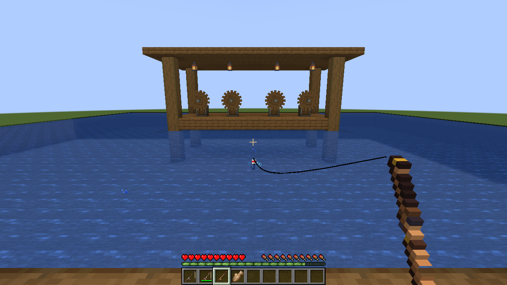

# Clockwork Tides

### Three rods. Three ways to read the water.

A compact Create addon for **Minecraft 1.21.1 · NeoForge · Java 21**. Sturdy andesite tackle brings workshop scraps home; patinated copper rewards the angler; brass precision gear recovers small lost components.

**[Русская инструкция](docs/INSTALL-RU.md)** · [Crafting recipes](docs/RECIPES.md) · [Fishing mechanics](docs/MECHANICS.md) · [Verification report](docs/TESTING.md)



[Watch the one-minute gameplay capture](docs/media/clockwork-tides-60sec.mp4) · [All three rods in inventory](docs/media/07-all-three-rods-inventory.png)

## The tackle box

| Rod | Durability | Specialty | Base bonus chance | Repair material |
|---|---:|---|---:|---|
| Andesite | 192 | Common workshop salvage | 12% | Andesite alloy |
| Copper | 256 | Extra fish | 18% | Copper ingot |
| Brass | 384 | Small Create components | 12% | Brass ingot |

Normal Minecraft fishing loot remains intact. A legitimate catch in open water may also roll your rod's bonus table. Rain adds 3 percentage points; positive fishing luck adds up to another 3. The default total is capped at 25%. No packets let clients choose their rewards.

- Original **32×32** item sprites, with distinct cast and uncast states
- Vanilla casting, reeling, XP and advancement behavior
- Lure, Luck of the Sea, Unbreaking, Mending and Curse of Vanishing compatibility
- Server-owned configuration and datapack-editable bonus loot
- No biome/world generation changes, custom network protocol, or forced replacement of vanilla fishing tables
- English and Russian names, descriptions and documentation

## Install

**Easiest:** import the included `.mrpack` in Prism Launcher or Modrinth App. It contains our addon and downloads the pinned official Create release plus Minecraft/NeoForge through the launcher. Use your licensed Minecraft account.

**Manual installation:**

1. Use a licensed Minecraft Java 1.21.1 installation with **NeoForge 21.1.219** and Java 21
2. Install official **Create 6.0.10**: [Modrinth release](https://modrinth.com/mod/create/version/UjX6dr61)
3. Put `clockwork-tides-1.0.0.jar` in the instance's `mods` folder
4. Install the same versions on the server and every client

The full official Create JAR already contains Ponder, Flywheel and Registrate. Do not add separate copies. Forge and Fabric builds are not compatible with this release.

The convenience ZIP contains our JAR, docs and a checksum-verifying Create downloader. It does **not** rehost Create or Minecraft. Run `python tools/fetch-create.py /path/to/instance/mods`, or on Windows use `tools/fetch-create.ps1 -ModsDirectory 'C:\path\to\mods'`. The pinned download is unchanged and comes directly from the official Modrinth CDN. See [third-party notices](THIRD-PARTY-NOTICES.md).

## Play

Follow the [three crafting recipes](docs/RECIPES.md), then fish as usual. The bonus requires a real successful catch and vanilla open-water conditions; reeling early, snagging an entity, or fishing in an enclosed AFK chamber grants no bonus.

**Upgrade crafting consumes the old rod and does not preserve enchantments or custom names. Craft your desired tier before enchanting.** Anvils repair each rod with its listed material; normal same-item repairs also work.

## Configure

Server balance lives in the world's `serverconfig/clockwork_tides-server.toml`. Disable extra drops with `enableBonusCatch=false`; adjust each base chance, rain/luck bonuses and the chance cap. Changing configuration does not change vanilla catch timing.

Bonus tables are `data/clockwork_tides/loot_table/gameplay/fishing/{andesite,copper,brass}.json`. Override them through a datapack and use `/reload`. See [mechanics](docs/MECHANICS.md) for item weights and probabilities.

## Build from source

```sh
./gradlew build
./gradlew runGameTestServer
./gradlew runClient
```

Java 21 is required. Gradle's wrapper checksum is pinned. The build resolves NeoForge and the Create team's matching developer dependencies from official Maven repositories. The game is downloaded only into local development caches and is never included in the addon. Developer QA harness classes and test structures are excluded from the release JAR.

## License & credits

Clockwork Tides code and original art: [MIT](LICENSE). Built for [Create](https://github.com/Creators-of-Create/Create) and [NeoForge](https://neoforged.net/). See [third-party notices](THIRD-PARTY-NOTICES.md).

Not an official Minecraft product. Not approved by or associated with Mojang or Microsoft, or the Create team.
